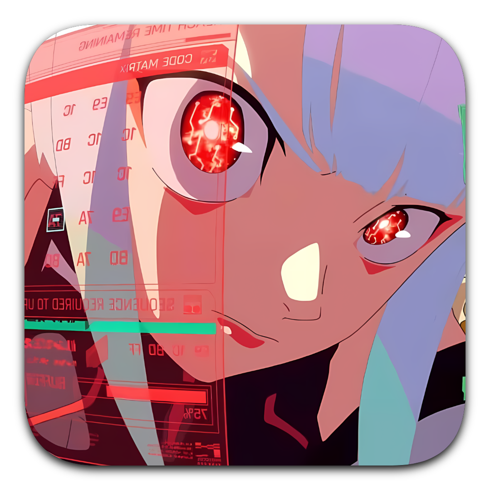

<div align="center">



# IceBreaker

A lightweight, native single-DLL Steam hook for automated Lua plugin & manifest loading.

<a href="https://github.com/NetrunnerGames/IceBreaker/releases/tag/v1.0a"></a>
<a href="LICENSE"></a>

</div>

> [!IMPORTANT]
> **DISCLAIMER & NOTICE**
> IceBreaker is an independent open-source client hook utility. It is not affiliated with, endorsed by, or associated with Valve Corporation or Steam. All trademarks belong to their respective owners.

---

## Overview

**IceBreaker** (`version.dll`) is a self-contained, native 64-bit/32-bit proxy DLL designed to hook into Steam desktop client processes. It forwards system version API calls to Windows system binaries while initializing internal hook procedures for loading Lua manifests and CEF plugin extensions.

## Key Features

- **Single-DLL Footprint**: Operates as a single proxy DLL (`version.dll`) placed directly in the Steam root directory.
- **Dynamic Lua Manifest Reloading**: Automatically scans all manifest directories (including default `config/stplug-in/*.lua` and custom configured paths) for manifest additions and hot-reloads without requiring Steam restarts.
- **CloudRedirect Compatibility**: Full native support for third-party cloud storage providers (Google Drive, OneDrive, Cloudflare R2).
- **Zero Configuration Overrides**: Transparent API proxying ensuring full Windows system binary stability.

---

## Deployment & Usage

### Manual Installation
1. Download `version.dll` from the latest [Release (v1.0a)](https://github.com/NetrunnerGames/IceBreaker/releases/tag/v1.0a).
2. Copy `version.dll` into your Steam client installation root folder (e.g. `C:\Program Files (x86)\Steam\`).
3. Launch Steam.

### Automated Management
IceBreaker is managed automatically as the recommended native backend inside [DataJackUI](https://github.com/NetrunnerGames/DataJackUI).

---

## Building from Source

### Requirements
- Visual Studio 2022 (with C++ Desktop Workload) or MSVC / CMake.
- Windows SDK 10.0+.

### Compiling
```powershell
mkdir build
cd build
cmake ..
cmake --build . --config Release
```

Output binary: `bin/Release/version.dll`
